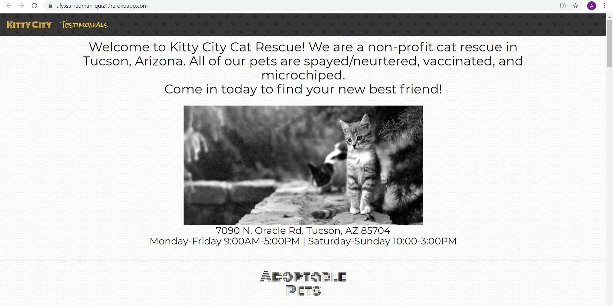
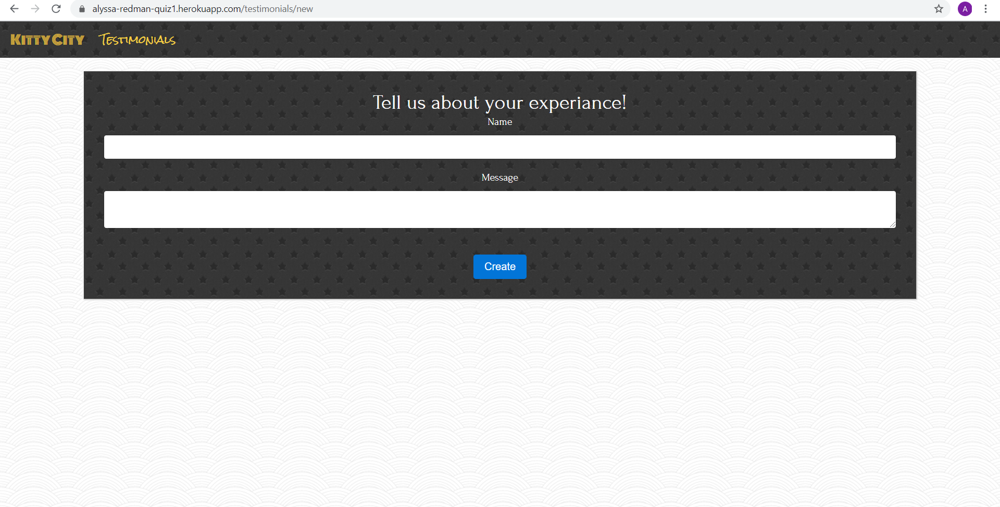

# Kitty City

A static pet adoption website that utilizes Simple Form gem for a testimonials section.

[View the deployed application](https://alyssa-redman-quiz1.herokuapp.com/)

_______

### Features: 

* Built using Ruby 2.5.3

* jQuery

* Simple Form gem for testimonial section

* Bootstrap, CSS, and Mini Magic for front end elements

* PostgresSQL

_______

### How to use

Guests can view a picture and brief description of pets available for adoption. Guests also have the option of leaving a comment on the Testimonials page.

_______

### Screenshots:

